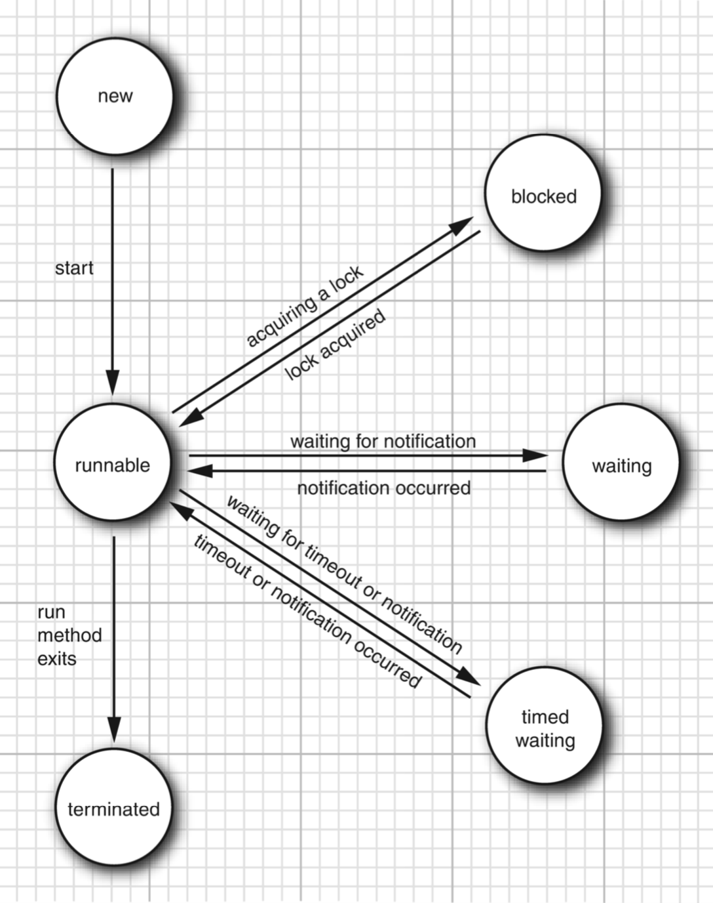

# 并发

## 线程

### 状态

- New
- Runnable
- Blocked
- Waiting
- Time Waiting
- Terminated

{:height="50%" width="50%"}

### 终止

#### 常用方法

- void interrupt() 中断一个线程

  - 如果「调用 interrupt 的线程」和「被中断的线程」不是同一个线程，需要检查权限。
  - 如果线程了调用了 Object 的 wait、wait(long)、wait(long, int) 或者 Thead 的 join、join(long)、join(long, int)、sleep(long)、sleep(long, int)，会清除线程的中断位，并抛出一个 InterruptedException。
  - java.nio.channels.InterruptibleChannel
  - java.nio.channels.Selector
  - 如果不是以上的情况，则会设置线程的中断位。

- boolean interrupted() 返回当前线程的中断位是否被设置了，并重置中断位。
- boolean isInterrupted() 返回当前线程的中断位是否被设置了，不改变中断位。
- boolean isInterrupted(boolean ClearInterrupted) 返回当前线程的中断位是否被设置了，根据参数决定是否重置中断位。

#### 相关说明

https://www.zhihu.com/question/41048032/answer/89431513

首先，一个线程不应该由其他线程来强制中断或停止，而是应该由线程自己自行停止。
所以，Thread.stop, Thread.suspend, Thread.resume 都已经被废弃了。
而 Thread.interrupt 的作用其实也不是中断线程，而是「通知线程应该中断了」，
具体到底中断还是继续运行，应该由被通知的线程自己处理。

具体来说，当对一个线程，调用 interrupt() 时，
① 如果线程处于被阻塞状态（例如处于sleep, wait, join 等状态），那么线程将立即退出被阻塞状态，并抛出一个InterruptedException异常。仅此而已。
② 如果线程处于正常活动状态，那么会将该线程的中断标志设置为 true，仅此而已。被设置中断标志的线程将继续正常运行，不受影响。

interrupt() 并不能真正的中断线程，需要被调用的线程自己进行配合才行。

也就是说，一个线程如果有被中断的需求，那么就可以这样做。

① 在正常运行任务时，经常检查本线程的中断标志位，如果被设置了中断标志就自行停止线程。

② 在调用阻塞方法时正确处理InterruptedException异常。（例如，catch异常后就结束线程。）

```text
Thread thread = new Thread(() -> {
    while (!Thread.interrupted()) {
        // do more work.
    }
});
thread.start();

// 一段时间以后
thread.interrupt();
```


## 锁

#### 条件对象

某种程度上，条件对象 = 事件通知 + 锁。

条件对象可以只通知一个（notify），事件则是全部都会通知到。

条件对象也可以通知全部(notifyAll)。


#### Thread 几个获取锁的方法的对比

- lock
- tryLock


#### 如何选择同步的方式

- 优先使用 java.util.concurrent 包中的类、方法
- 其次选择 synchronized：简单，不易出错

synchrnized 直接包裹代码块/方法

[等价于使用了内置的锁来执行 Lock.lock，Lock.unlock]

Object：wait - signal、signalAll

[等价于使用了内置的锁对应的唯一一个 Condition 来执行 Condition.await，Condition.notify]

**调用 wait、signal、signalAll 必须在同步代码块内，即当前线程持有相应的锁。**

- 只有必要时才选择 Lock/Condition：可控性高，复杂。

Lock：lock - unlock

Lock.Condition：await - notify、notifyAll

**调用 Condition 的 await、notify、notifyAll 前，必须先持有相应的 Lock。**


```java
// 一般是这么用的
Lock l = new ReentrantLock();
Condition c1 = l.netCondition();
Condition c2 = l.netCondition();

// 很少这么用
Lock l1 = new ReentrantLock();
Lock l2 = new ReentrantLock();
Condition c1 = l1.netCondition();
Condition c2 = l2.netCondition();

```


#### 客户端锁

```java
class ListUp {
  List<Integer> list;
  
  // 如果所有对 list 的访问都封装在类里，并加了锁限制，则是同步的。
  
  // 如果存在某些地方(包括类内部和外部直接使用 list)没有加锁，那么就是不安全的。
  
  // 如果内部的所有访问都加了锁，外部能直接访问 list
  // - 如果使用的是 synchronize(list)，且 list 内部的操作都使用了 synchronize 来加锁，则是线程安全的。但这依赖于 list 的实现。！
}
```

#### final

- final 保证线程会在构造函数完成构造之后才看到这个变量，但多个线程对该变量进行修改不是线程安全的。